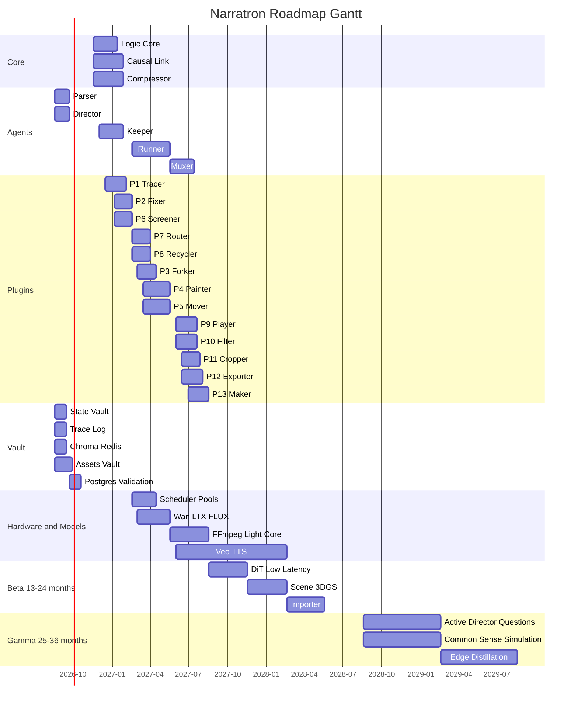

<p align="center">
  <h1 align="center">🎬 Narratron</h1>
  <p align="center"><strong>AI 影視級因果敘事生成平台</strong></p>
  <p align="center"><em>Every Frame Carries Its Past.</em></p>
</p>

<p align="center">
  
  
  
  
</p>

---

當前 AI 影片工具只有「三秒金魚腦」——每一幀都是獨立快照，前因後果全丟。Narratron 以**全量因果記錄**為第一性原理，生成的不是快照，而是**因果壓縮包**。

> 白皮書 v2.0（架構凍結版）：[`docs/whitepaper-v2.md`](docs/whitepaper-v2.md)

---

## 目錄

- [核心功能](#核心功能)
- [門面首頁與 GUI](#門面首頁與-gui)
- [快速啟動](#快速啟動)
- [架構總覽](#架構總覽)
- [API 端點](#api-端點)
- [模組實作時間表](#模組實作時間表)
- [技術路線](#技術路線)
- [命名速查](#命名速查)
- [文件地圖](#文件地圖)

---

## 核心功能

### ✅ 已落地（Alpha Q1）

| 功能 | 代號 | 說明 | 路徑 |
|------|------|------|------|
| 📝 **劇本解析** | `Parser` | 讀取劇本，自動提取角色、道具、場景實體，初始化 State Vault | `narratron/agents/parser.py` |
| 🎬 **分鏡調度** | `Director` | 將故事拆解為分鏡，自動決定鏡頭語言（全景/特寫/跟拍/過肩） | `narratron/agents/director.py` |
| 🗄️ **狀態庫** | `State Vault` | PostgreSQL JSONB 或本機記憶體，儲存實體/分鏡/資產 | `narratron/vault/` |
| 📋 **因果記錄** | `Trace Log` | 每一步操作都有因果記錄（cause → effect），為因果壓縮包奠基 | `narratron/vault/trace_log.py` |
| 👤 **角色管理** | `CharacterOS` | 角色護照 (.charpass) 全生命週期：建立、編輯、版本控制 | `characteros/` |
| 🎨 **生圖管線** | `Imaging` | 可插拔 provider：WAN（阿里百煉）/ OpenAI 相容 / 自訂 HTTP | `characteros/imaging/` |
| 📊 **佇列中心** | `Queue` | 年齡軸 pipeline：1–80 歲逐步生圖，一次一張，完成自動入庫 | `characteros/services/queue*.py` |
| 🕸️ **因果圖** | `Causal Graph` | 視覺化 Trace Log 因果鏈：實體 → 痕跡 → 分鏡有向圖 | `gui/streamlit_app.py` |

### 🔜 預計上線

| 功能 | 代號 | 預計 | 說明 |
|------|------|------|------|
| 🛡️ 守護器 | `Keeper` | Alpha Q2 | 因果鏈驗證與連續性檢查 |
| 🎥 執行器 | `Runner` | Alpha Q3 | 呼叫影片生成模型（Wan2.1 / LTX） |
| 🎞️ 合流器 | `Muxer` | Alpha Q4 | 多鏡頭合成為完整影片 |

---

## 門面首頁與 GUI

Narratron 提供多個 GUI 介面，覆蓋所有功能點：

### 🏠 門面首頁（`/`）

統一入口頁面，包含專案介紹、功能卡片導航、架構圖。所有子系統一頁直達。

```
CharacterOS 啟動後：http://localhost:8001/
```

### 📝 劇本解析 GUI（首頁 → #parse）

貼上劇本 → 一鍵解析 → 自動顯示實體統計、因果記錄數量、資產數量。支援：
- 中英文混合劇本
- 場景標記（INT./EXT.）
- 角色/道具/場景區塊
- 參考圖 URI（``）
- 一鍵載入範例劇本

### 🎬 分鏡調度 GUI（首頁 → #direct）

完整劇本 → 分鏡序列時間軸。每個 shot 顯示：
- 鏡頭語言（全景 Establishing / 特寫 Close-up / 跟拍 Tracking / 過肩 OTS）
- 持續時間（ms）
- 場景關聯

### 👤 角色管理 GUI（首頁 → #characters）

- **角色清單**：含縮圖預覽、名稱搜尋、標籤顯示
- **編輯器**：名稱 / 年齡 / 性別光譜 / 標籤 / 風格預設 / manifest JSON
- **護照預覽**：即時查看 .charpass 內容

### 🎨 生圖管線 GUI（首頁 → #imaging）

三個分頁：
- ⚙️ **生圖設定**：Provider / Model / Base URL / API Key
- 🎨 **生成圖片**：選角色 → 選用途 → 一鍵排入佇列
- 🔌 **Provider 列表**：查看可用的生圖後端

### 📊 佇列中心 GUI（首頁 → #queue）

- **統計面板**：等待中 / 排隊中 / 已完成 / 失敗數量
- **任務表格**：ID / 角色 / 狀態 / 用途 / 時間 / 操作
- **圖片預覽**：生成結果直接顯示
- **一鍵操作**：開始自動生圖 / 暫停 / 批次接受 / 重設失敗

### 🕸️ 因果圖 GUI（首頁 → #graph）

SVG 互動式因果關係圖：
- 🔵 藍色節點：角色（Character）
- 🟣 紫色節點：道具（Prop）
- 🟢 綠色節點：場景（Scene）
- 🟡 黃色節點：分鏡（Shot）
- 🔴 紅色節點：因果記錄（Trace）

附帶 Trace Log Inspector，點擊可展開完整 JSON。

### 📡 系統監控 GUI（首頁 → #monitor）

- Health Check（系統狀態）
- 系統指標（角色數 / Profile 數 / 變體數）
- Worker 狀態（忙碌 / 暫停 / 最近任務）

### 🖥️ CharacterOS 管理面板（`/admin/panel`）

進階管理面板，包含：
- 完整角色編輯器（Core + Profile + Manifest）
- 生圖設定與 API Key 管理
- 年齡軸 pipeline 可視化（1–80 歲時間軸格子）
- 佇列任務詳細表格
- 後端 worker 控制

### 📊 Streamlit GUI（`gui/streamlit_app.py`）

獨立的 Streamlit 應用，五個畫面：
- **Pad**：寫板（劇本輸入）
- **Timeline**：時軌（shot 序列）
- **Dashboard**：總覽（統計 + 角色護照導入導出）
- **Map**：因果圖（pyvis 互動式）
- **Player**：播放器（預留）

```bash
pip install -e ".[gui]"
streamlit run gui/streamlit_app.py
```

---

## 快速啟動

### 前置需求

- Python 3.11+
- Docker Compose（可選，僅 `VAULT_BACKEND=postgres` 時需要）

### 安裝

```bash
# 1. 複製環境設定
cp .env.example .env

# 2. 安裝相依套件
pip install -e ".[dev]"

# 3. 一致性檢查 + 測試
python scripts/check_consistency.py
pytest
```

### 啟動服務

```bash
# 方式一：本機模式（預設，無需 Docker）
uvicorn characteros.main:app --port 8001 --reload

# 方式二：含基礎設施（PostgreSQL + Redis + Chroma）
docker compose up -d
uvicorn characteros.main:app --port 8001 --reload

# Narratron API 閘道（可選，獨立埠）
uvicorn narratron.api.app:app --port 8080 --reload
```

### 存取介面

| 介面 | 網址 | 說明 |
|------|------|------|
| 🏠 門面首頁 | `http://localhost:8001/` | 專案介紹 + 全功能 GUI |
| 📖 API 文件 | `http://localhost:8001/docs` | Swagger UI |
| 🖥️ 管理面板 | `http://localhost:8001/admin/panel` | 進階角色編輯 + 佇列管理 |
| 📊 Streamlit | `http://localhost:8501` | 獨立 Streamlit GUI |
| 🎬 Narratron API | `http://localhost:8080/health` | 核心解析 API |

### Docker Compose 服務

| 服務 | 白皮書代號 | 預設埠 | 用途 |
|------|-----------|--------|------|
| PostgreSQL | `State Vault`（JSONB） | 5432 | 角色/分鏡持久化 |
| Redis | 快取層 | 6379 | 分鏡快取 |
| Chroma | 向量中樞 | 8000 | 實體向量索引 |

`.env` 中的 `VAULT_BACKEND`：
- `memory`（預設）：單元測試 / 無 Docker，資料存記憶體
- `postgres`：使用 Docker Compose 的 PostgreSQL

---

## 架構總覽

```
劇本輸入
   ↓
┌──────────────────────────────────────────┐
│  Narratron Core                          │
│                                          │
│  Parser（提取實體 + 因果記錄）            │
│      ↓                                   │
│  Director（分鏡 + 鏡頭語言）              │
│      ↓                                   │
│  ┌──────────┬──────────┬──────────┐      │
│  │ State    │ Trace    │ Chroma/  │      │
│  │ Vault    │ Log      │ Redis    │      │
│  └──────────┴──────────┴──────────┘      │
└──────────────────────────────────────────┘
   ↓
┌──────────────────────────────────────────┐
│  CharacterOS                             │
│                                          │
│  角色管理 ← → 角色護照 (.charpass)       │
│      ↓                                   │
│  生圖管線（可插拔 Provider）              │
│      ↓                                   │
│  佇列 Worker（一次一張，自動入庫）        │
└──────────────────────────────────────────┘
   ↓
┌──────────────────────────────────────────┐
│  （Alpha Q2–Q4 逐步啟用）                │
│  Keeper → Runner → Muxer → 最終影片      │
└──────────────────────────────────────────┘
```

### 雙軌儲存架構

Narratron 採用 graceful degradation 設計：

| 模式 | 觸發條件 | 資料位置 | 適用場景 |
|------|----------|----------|----------|
| **本機 JSON** | 預設 / PostgreSQL 不可用 | `data/charpasses/` | 開發、測試、離線 |
| **PostgreSQL** | `VAULT_BACKEND=postgres` | Docker Compose | 生產、團隊協作 |

系統會自動偵測 PostgreSQL 連線狀態，失敗時無縫降級到本機 JSON，zero-config 開發體驗。

---

## API 端點

### Narratron Core API（埠 8080）

| 方法 | 路徑 | 狀態 | 說明 |
|------|------|------|------|
| `GET` | `/health` | ✅ | 系統健康檢查 |
| `POST` | `/parse` | ✅ | 劇本 → 角色/道具/場景 + Trace Log |
| `POST` | `/direct` | ✅ | 劇本 → 解析 + 分鏡 + 鏡頭語言 |
| `POST` | `/keep` | 501 | 守護器（Alpha Q2） |
| `POST` | `/run` | 501 | 執行器（Alpha Q3） |
| `POST` | `/mux` | 501 | 合流器（Alpha Q4） |

### CharacterOS API（埠 8001）

#### 角色管理

| 方法 | 路徑 | 說明 |
|------|------|------|
| `GET` | `/api/v1/characters` | 列出角色（支援分頁、名稱搜尋、標籤過濾） |
| `GET` | `/api/v1/characters/{id}` | 取得角色完整資訊 |
| `GET` | `/api/v1/characters/{id}/editor` | 編輯器讀取（Core + Profile） |
| `PUT` | `/api/v1/characters/{id}/editor` | 編輯器儲存 |
| `GET` | `/api/v1/characters/{id}/charpass` | 讀取角色護照 |
| `POST` | `/api/v1/characters/{id}/charpass` | 寫回角色護照 |
| `GET` | `/api/v1/characters/{id}/versions` | 版本快照與分支摘要 |
| `GET` | `/api/v1/characters/{id}/assets/{path}` | 角色資產（圖片等） |

#### 變體與生圖

| 方法 | 路徑 | 說明 |
|------|------|------|
| `GET` | `/api/v1/characters/{id}/variant` | 請求變體（排入佇列或回傳已就緒） |
| `GET` | `/api/v1/characters/{id}/variants` | 列出所有變體 |
| `POST` | `/api/v1/characters/{id}/image-queue` | 排入生圖佇列 |
| `GET` | `/api/v1/imaging/providers` | 列出可用生圖 provider |

#### 佇列管理

| 方法 | 路徑 | 說明 |
|------|------|------|
| `GET` | `/api/v1/admin/queue-stats` | 佇列統計 |
| `GET` | `/api/v1/admin/queue-tasks` | 任務列表（支援篩選） |
| `POST` | `/api/v1/admin/queue-tasks/{id}/accept` | 接受任務 |
| `POST` | `/api/v1/admin/queue-tasks/{id}/reject` | 拒絕任務 |
| `POST` | `/api/v1/admin/queue-tasks/{id}/reset` | 重設 failed 任務 |
| `POST` | `/api/v1/admin/queue-tasks/accept-all` | **批次接受所有已完成** |
| `POST` | `/api/v1/admin/queue-tasks/reset-failed` | 批次重設失敗任務 |
| `POST` | `/api/v1/admin/queue-tasks/clear` | 清空佇列 |
| `POST` | `/api/v1/admin/queue-tasks/process-next` | 處理下一筆 pending |
| `POST` | `/api/v1/admin/queue-worker/start` | 啟動自動 worker |
| `POST` | `/api/v1/admin/queue-worker/pause` | 暫停 worker |

#### 系統

| 方法 | 路徑 | 說明 |
|------|------|------|
| `GET` | `/api/v1/health` | CharacterOS 健康檢查 |
| `GET` | `/api/v1/admin/metrics` | 系統指標 |
| `GET` | `/api/v1/admin/imaging-config` | 讀取生圖設定 |
| `PUT` | `/api/v1/admin/imaging-config` | 更新生圖設定 |

---

## 模組實作時間表

> 原則：只准按季推進，禁止跳做 Beta/Gamma 模組。

### 總覽甘特圖



### 季度日曆

| 階段 | 季度 | 日曆 | 主題 | 本季 KPI |
|:---|:---|:---|:---|:---|
| **Alpha** | Q1 | 2026-08 ~ 2026-11 | 地基與解析 | Vault 可初始化角色/道具/場景；劇本可拆分鏡 |
| **Alpha** | Q2 | 2026-11 ~ 2027-02 | 因果閉環 | `Screener` 連續性誤差 < 5% |
| **Alpha** | Q3 | 2027-02 ~ 2027-05 | 外掛生態 | 開源/商用切換，成本 -60%；本地 720p |
| **Alpha** | Q4 | 2027-05 ~ 2027-08 | 工業化驗證 | 5–10 分鐘因果連續樣片 |
| **Beta** | Q1 | 2027-08 ~ 2027-11 | DiT 迭代 | 草案延遲 3–5 秒 |
| **Beta** | Q2 | 2027-11 ~ 2028-02 | 3DGS | 鏡頭移動背景扭曲趨近於零 |
| **Beta** | Q3 | 2028-02 ~ 2028-05 | 多模態 | `Importer` 建檔 |
| **Beta** | Q4 | 2028-05 ~ 2028-08 | 封測 | 100 位創作者 |
| **Gamma** | Q1–Q2 | 2028-08 ~ 2029-02 | 自主拍攝 | `Director` 主動提問 |
| **Gamma** | Q3–Q4 | 2029-02 ~ 2029-08 | 個人化劇場 | 輸入 10%、系統補 90% |

### 當前進度（Alpha Q1）

| 週次 | 日期 | 模組 | 狀態 |
|:---|:---|:---|:---|
| W1–W2 | 08-18 ~ 08-31 | State Vault / Trace Log / Chroma / Redis | ✅ 已完成 |
| W3–W4 | 09-01 ~ 09-14 | Parser 劇本提取 / Director 分鏡 | ✅ 已完成 |
| W5 | 09-15 ~ 09-21 | 參考圖 assets / IP-Adapter 佇列 | ✅ 已完成 |
| W6–W9 | 09-22 ~ 10-19 | Postgres 驗收 / 分鏡品質打磨 | 🔄 進行中 |
| W10–W13 | 10-20 ~ 11-17 | Q1 驗收：單場景閉環文件化 | ⏳ 未開始 |

### 開發邊界（硬限制）

- ❌ 不新增 Q2+ 模組實作
- ❌ 不接任何模型真實生成 API
- ❌ 不新增 `Importer` 或 Gamma 專屬模組
- ✅ 所有修改需通過 `scripts/check_consistency.py` + `pytest`

---

## 技術路線

| 階段 | 時間 | 目標 | 終極 KPI |
|:---|:---|:---|:---|
| **Alpha** | 1–12 月 | 連續性征服 | 衣物/傷痕穿幫率趨近於零；P6 誤差 < 5% |
| **Beta** | 13–24 月 | 即時化與 3DGS | 草案延遲 3–5 秒；背景扭曲趨近於零 |
| **Gamma** | 25–36 月 | 通用敘事智慧 | 創作者輸入 10%，系統補 90% |

### 核心技術棧

| 層級 | 技術 | 用途 |
|------|------|------|
| **API 框架** | FastAPI + Pydantic v2 | 型別安全的 API 閘道 |
| **狀態管理** | LangGraph | 五智能體資料流 |
| **持久化** | PostgreSQL JSONB | State Vault |
| **快取** | Redis | 分鏡快取 |
| **向量索引** | ChromaDB | 實體語意搜尋 |
| **角色資產** | .charpass（JSON/ZIP） | 角色護照格式 |
| **生圖** | WAN / OpenAI 相容 / HTTP | 可插拔 Provider |
| **前端** | 原生 HTML/JS + Streamlit | GUI 介面 |

---

## 命名速查

完整凍結表：[`docs/naming.md`](docs/naming.md)

| 類別 | 代號 | 中文 | 路徑 |
|:---|:---|:---|:---|
| 平台 | `Narratron` | 敘事體 | — |
| 角色後端 | `CharacterOS` | 角色控制子系統 | `characteros/` |
| 狀態庫 | `State Vault` | 狀態庫 | `narratron/vault/` |
| 因果橋 | `Causal Link` | 因果橋 | `narratron/core/causal_link.py` |
| 壓縮器 | `Compressor` | 壓縮器 | `narratron/core/compressor.py` |
| 篩檢 | `Screener` | 篩檢 | `narratron/plugins/screener.py` |
| 路由 | `Router` | 路由 | `narratron/plugins/router.py` |
| 執行器 | `Runner` | 執行器 | `narratron/agents/runner.py` |
| 大核 | `Big Core` | 頂級算力 | `narratron/hardware/pools.py` |

---

## 專案結構

```
Narratron/
├── narratron/                  # 核心平台
│   ├── agents/                 # 智能體（Parser, Director, Keeper, Runner, Muxer）
│   ├── api/                    # FastAPI 閘道
│   ├── charpass/               # 角色護照格式處理
│   ├── core/                   # 核心演算法（Causal Link, Compressor, Logic Core）
│   ├── hardware/               # 硬體排程（Scheduler, Pools）
│   ├── models/                 # 模型介面（Wan, Flux, FFmpeg, TTS, Veo）
│   ├── plugins/                # 外掛系統（13 個 Plugin）
│   └── vault/                  # 資料層（State Vault, Trace Log, Chroma, Redis）
│
├── characteros/                # 角色控制子系統
│   ├── imaging/                # 生圖管線（可插拔 Provider）
│   ├── models/                 # ORM + Schema
│   ├── routers/                # API 路由
│   ├── services/               # 業務業務邏輯（佇列、生圖、年齡軸）
│   ├── storage/                # 本機 JSON 儲存
│   └── static/                 # 門面首頁 HTML
│
├── gui/                        # Streamlit GUI
├── frontend/                   # 前端規格文件
├── docs/                       # 文件（白皮書、路線圖、命名）
├── tests/                      # 測試
├── scripts/                    # 工具腳本
├── docker/                     Docker 初始化
├── data/                       # 執行時資料
├── docker-compose.yml          # 基礎設施
├── pyproject.toml              # 專案設定
└── .env.example                # 環境變數範本
```

---

## 文件地圖

| 文件 | 內容 |
|:---|:---|
| [`docs/whitepaper-v2.md`](docs/whitepaper-v2.md) | 完整白皮書（v2.0 架構凍結版） |
| [`docs/architecture.md`](docs/architecture.md) | 分層 → 目錄對照 |
| [`docs/interfaces.md`](docs/interfaces.md) | Protocol / Schema 契約 |
| [`docs/charpass.md`](docs/charpass.md) | Character Passport / `.charpass` 格式規格 |
| [`docs/roadmap.md`](docs/roadmap.md) | Alpha / Beta / Gamma 路線圖 + KPI |
| [`docs/naming.md`](docs/naming.md) | 命名凍結表與禁止別名 |
| [`frontend/README.md`](frontend/README.md) | 前端五畫面規格 |
| [`UX_OPTIMIZATION_REPORT.md`](UX_OPTIMIZATION_REPORT.md) | 全面檢查報告與優化建議 |

---

## Contributing

1. Fork → Branch → PR
2. 所有修改需通過 `pytest` + `python scripts/check_consistency.py`
3. 不得跳做未來季度的模組
4. 命名嚴格對照 `docs/naming.md`

---

<p align="center">
  <strong>Narratron</strong> — AI 影視級因果敘事生成平台<br/>
  <em>Every Frame Carries Its Past.</em><br/><br/>
  日曆錨點：2026-08-18（Alpha Q1）→ 2029-08-17（Gamma 結束）
</p>
