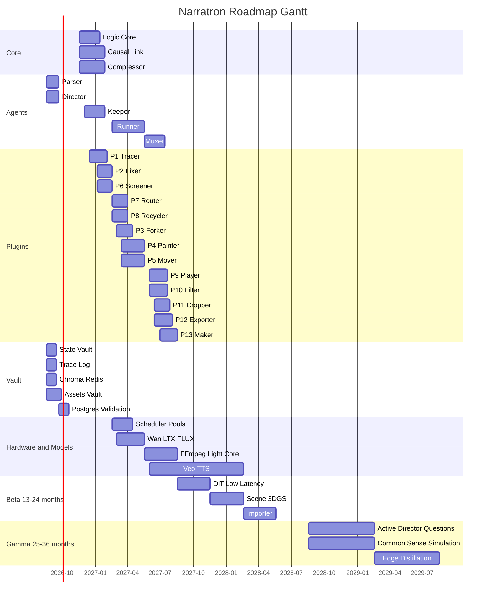

# Narratron

AI 影視級因果敘事生成平台。每一幀畫面都背負導致當前狀態的全部前因。

**核心口號**：*Every Frame Carries Its Past.*

當前 AI 影片工具只有「三秒金魚腦」；Narratron 以全量因果記錄為第一性原理，生成的不是快照，而是因果壓縮包。

官方白皮書（v2.0 架構凍結版）：[`docs/whitepaper-v2.md`](docs/whitepaper-v2.md)

**日曆錨點**：2026-08-18（Alpha 第 1 日）→ 2029-08-17（Gamma 結束），總跨度 36 個月。

---

## 本階段範圍

本 repo 已完成架構凍結，並於 **Alpha Q1（2026-08-18 ~ 2026-11-17）開工**。

| 已落地 | 下一季才做 |
| :--- | :--- |
| 白皮書、命名、介面契約 | `Causal Link` / `Compressor` / `Logic Core` 演算法（Q2） |
| `State Vault` + `Trace Log` 真實讀寫（記憶體預設；Postgres JSONB 可切） | `Keeper` + P6 `Screener` CV（Q2） |
| `Parser` / `Director` 劇本→實體→分鏡 | `Runner` 模型 API、Wan2.1 / LTX（Q3） |
| 參考圖資產庫 + IP-Adapter **僅排隊** | `Muxer` / `Exporter` 樣片（Q4） |
| `GET /health`、`POST /parse`、`POST /direct` | 前端五畫面；`POST /keep` `/run` `/mux` 仍 501 |

完整 KPI：[`docs/roadmap.md`](docs/roadmap.md)

---

## 模組實作時間表

> 原則：只准按季推進，禁止跳做 Beta/Gamma 模組檔（例如 `Importer`）。  
> 狀態：**已完成**＝本 repo 可跑；**進行中**＝本季目標；**未開始**＝後續季。

### 總覽甘特（全模組泳道）



錨點：**2026-08-18**。圖例：此甘特圖僅展示時間軸；完成/進行中請以文末「模組實作時間表」與「當前開發看板」為準。

### 季度日曆

| 階段 | 季度 | 日曆 | 主題 | 本季 KPI |
| :--- | :--- | :--- | :--- | :--- |
| **Alpha** | Q1 | 2026-08-18 ~ 2026-11-17 | 地基與解析 | Vault 可初始化角色/道具/場景；劇本可拆分鏡 |
| **Alpha** | Q2 | 2026-11-18 ~ 2027-02-17 | 因果閉環 | `Screener` 連續性誤差 **< 5%** |
| **Alpha** | Q3 | 2027-02-18 ~ 2027-05-17 | 外掛生態 | 開源/商用切換，成本 **-60%**；本地 720p |
| **Alpha** | Q4 | 2027-05-18 ~ 2027-08-17 | 工業化驗證 | 5–10 分鐘因果連續樣片；穿幫率趨近於零 |
| **Beta** | Q1 | 2027-08-18 ~ 2027-11-17 | DiT 迭代 | 草案延遲 **3–5 秒** |
| **Beta** | Q2 | 2027-11-18 ~ 2028-02-17 | 3DGS | 鏡頭移動背景扭曲趨近於零 |
| **Beta** | Q3 | 2028-02-18 ~ 2028-05-17 | 多模態 | `Importer` 建檔；`Alt Core` 備核 |
| **Beta** | Q4 | 2028-05-18 ~ 2028-08-17 | 封測 | 100 位創作者；拖曳改鏡頭 |
| **Gamma** | Q1–Q2 | 2028-08-18 ~ 2029-02-17 | 自主拍攝 | `Director` 主動提問；實體常識模擬器 |
| **Gamma** | Q3–Q4 | 2029-02-18 ~ 2029-08-17 | 個人化劇場 | 輸入 10%、系統補 90%；邊緣蒸餾 |

### 週次（僅 Alpha Q1，當前季）

| 週次 | 日期 | 模組 | 狀態 |
| :--- | :--- | :--- | :--- |
| W1–W2 | 08-18 ~ 08-31 | `State Vault` DDL、JSONB、`Trace Log`、Chroma/Redis 本機層 | **已完成** |
| W3–W4 | 09-01 ~ 09-14 | `Parser` 劇本提取、`Director` 分鏡與鏡頭語言 | **已完成**（提前開工） |
| W5 | 09-15 ~ 09-21 | 參考圖 `assets`、IP-Adapter 佇列、`POST /parse` `/direct` | **已完成**（提前開工） |
| W6–W9 | 09-22 ~ 10-19 | Postgres 連線驗收、分鏡品質打磨、契約測試擴充 | 進行中 |
| W10–W13 | 10-20 ~ 11-17 | Q1 驗收：單場景實體+分鏡閉環文件化 | 未開始 |

### 模組明細（開發排程）

| 模組 | 代號 | 路徑 | 開工 | 預完工 | 狀態 |
| :--- | :--- | :--- | :--- | :--- | :--- |
| API 閘道（health / parse / direct） | API | `narratron/api/` | 2026-08-18 | 2026-09-21 | **已完成（Q1 範圍）** |
| 狀態庫 | `State Vault` | `narratron/vault/state_vault.py` | 2026-08-18 | 2026-09-14 | **已完成** |
| 痕跡日誌 | `Trace Log` | `narratron/vault/trace_log.py` | 2026-08-18 | 2026-09-14 | **已完成** |
| 向量中樞 | Chroma | `narratron/vault/chroma.py` | 2026-08-18 | 2026-09-14 | **已完成（本機層）** |
| 快取層 | Redis | `narratron/vault/redis_cache.py` | 2026-08-18 | 2026-09-14 | **已完成（本機層）** |
| 解析器 | `Parser` | `narratron/agents/parser.py` | 2026-08-25 | 2026-09-21 | **已完成** |
| 調度器 | `Director` | `narratron/agents/director.py` | 2026-08-25 | 2026-09-21 | **已完成** |
| 參考圖資產庫 | `assets` | `narratron/vault/schema.py` | 2026-09-08 | 2026-09-28 | **已完成** |
| IP-Adapter 微調 | FLUX 佇列 | `narratron/models/flux.py` | 2026-09-08 | 2026-09-28 | **已完成（僅排隊）** |
| 路由（預設中核） | P7 `Router` | `narratron/plugins/router.py` | 2026-08-18 | 2027-03-31 | 介面可用；真選池 Q3 |
| 邏輯內核 | `Logic Core` | `narratron/core/logic_core.py` | 2026-11-18 | 2027-01-12 | 未開始 |
| 因果橋 | `Causal Link` | `narratron/core/causal_link.py` | 2026-11-18 | 2027-01-26 | 未開始 |
| 壓縮器 | `Compressor` | `narratron/core/compressor.py` | 2026-11-18 | 2027-01-26 | 未開始 |
| 守護器 | `Keeper` | `narratron/agents/keeper.py` | 2026-12-01 | 2027-01-26 | 未開始 |
| 追跡 | P1 `Tracer` | `narratron/plugins/tracer.py` | 2026-12-16 | 2027-02-03 | 未開始 |
| 固形 | P2 `Fixer` | `narratron/plugins/fixer.py` | 2027-01-06 | 2027-02-17 | 未開始 |
| 篩檢 | P6 `Screener` | `narratron/plugins/screener.py` | 2027-01-06 | 2027-02-17 | 未開始 |
| 執行器 | `Runner` | `narratron/agents/runner.py` | 2027-02-18 | 2027-05-17 | 未開始 |
| 重生 | P8 `Recycler` | `narratron/plugins/recycler.py` | 2027-02-18 | 2027-03-31 | 未開始 |
| 分岔 | P3 `Forker` | `narratron/plugins/forker.py` | 2027-03-01 | 2027-04-14 | 未開始 |
| 調色 | P4 `Painter` | `narratron/plugins/painter.py` | 2027-03-15 | 2027-05-17 | 未開始 |
| 擬動 | P5 `Mover` | `narratron/plugins/mover.py` | 2027-03-15 | 2027-05-17 | 未開始 |
| Wan2.1 / LTX | `Wan` | `narratron/models/wan.py` | 2027-03-01 | 2027-05-17 | 未開始 |
| FLUX 生成 | `Flux` | `narratron/models/flux.py` | 2027-03-01 | 2027-05-17 | 未開始（generate 禁止） |
| 排程器 | `Scheduler` | `narratron/hardware/scheduler.py` | 2027-02-18 | 2027-04-14 | 未開始 |
| 算力池真切換 | Big/Mid/Alt | `narratron/hardware/pools.py` | 2027-02-18 | 2027-04-14 | 未開始（現固定 Mid） |
| 合流器 | `Muxer` | `narratron/agents/muxer.py` | 2027-05-18 | 2027-07-13 | 未開始 |
| 配樂 | P9 `Player` | `narratron/plugins/player.py` | 2027-06-01 | 2027-07-20 | 未開始 |
| 濾聲 | P10 `Filter` | `narratron/plugins/filter.py` | 2027-06-01 | 2027-07-20 | 未開始 |
| 裁切 | P11 `Cropper` | `narratron/plugins/cropper.py` | 2027-06-15 | 2027-07-27 | 未開始 |
| 轉檔 | P12 `Exporter` | `narratron/plugins/exporter.py` | 2027-06-15 | 2027-08-03 | 未開始 |
| 製本 | P13 `Maker` | `narratron/plugins/maker.py` | 2027-07-01 | 2027-08-17 | 未開始 |
| FFmpeg / 輕核 | `FFmpeg` | `narratron/models/ffmpeg.py` | 2027-05-18 | 2027-07-13 | 未開始 |
| 分層儲存 | `Tier Store` | `narratron/hardware/tier_store.py` | 2027-05-18 | 2027-08-17 | 未開始 |
| 寫板 | `Pad` | `frontend/pad.md` | 2027-06-01 | 2027-08-17 | 僅文件 |
| 時軌 | `Timeline` | `frontend/timeline.md` | 2027-06-15 | 2027-08-17 | 僅文件 |
| 總覽 | `Dashboard` | `frontend/dashboard.md` | 2027-07-01 | 2027-08-17 | 僅文件 |
| 因果圖 | `Map` | `frontend/map.md` | 2027-07-01 | 2027-08-17 | 僅文件 |
| 播放器 | `Player` | `frontend/player.md` | 2027-07-15 | 2027-08-17 | 僅文件 |
| Veo / Seedance | `Veo` | `narratron/models/veo.py` | 2027-08-18 | 2028-02-17 | 未開始 |
| TTS | `TTS` | `narratron/models/tts.py` | 2027-06-01 | 2027-08-17 | 未開始 |
| 匯入器 | `Importer` | （禁止提前建檔） | 2028-02-18 | 2028-05-17 | 未開始 |
| 備核部署 | `Alt Core` | `narratron/hardware/pools.py` | 2028-02-18 | 2028-05-17 | 未開始 |
| 3DGS 管線 | 3DGS | `narratron/models/` | 2027-11-18 | 2028-02-17 | 未開始 |
| 實體常識模擬器 | Gamma | — | 2028-08-18 | 2029-02-17 | 未開始 |
| 個人化敘事引擎 | Gamma | — | 2029-02-18 | 2029-08-17 | 未開始 |

**本 repo 停在**：Alpha Q1 核心閉環（Vault + Parser + Director）已可跑；Q1 剩餘為 Postgres 實機驗收與分鏡品質打磨。不得跳去 Q2 演算法或模型呼叫。

---

## 當前開發看板（已開工）

> 目的：把「時間表」落成可執行清單。以下只允許 Alpha Q1 任務，禁止越級到 Q2+。

### Q1 進行中模組（Now）

| 模組 | 路徑 | 本週目標 | 驗收條件 |
| :--- | :--- | :--- | :--- |
| `State Vault`（Postgres 驗收） | `narratron/vault/postgres.py` | 驗證 `VAULT_BACKEND=postgres` 寫入/讀取一致 | `tests/test_vault.py` 全綠，memory/postgres 結果一致 |
| `Director`（分鏡品質） | `narratron/agents/director.py` | 補強分鏡切分穩定性與鏡頭語言欄位完整度 | `tests/test_director.py` 全綠，空欄位不回傳 |
| 契約一致性檢查 | `scripts/check_consistency.py` | 檢查 13 外掛、命名與文件 1:1 對齊 | 命名無漂移、缺檔數 = 0 |

### Q1 近兩週節奏（執行版）

| 週次 | 日期 | 開發項目 | 交付物 |
| :--- | :--- | :--- | :--- |
| W6 | 09-22 ~ 09-28 | Postgres 實機驗收 + 回歸測試 | Vault 讀寫測試報告 |
| W7 | 09-29 ~ 10-05 | Director 分鏡品質打磨 | 分鏡輸出品質對照樣本 |
| W8 | 10-06 ~ 10-12 | 一致性檢查腳本擴充 | 命名/外掛完整性報告 |
| W9 | 10-13 ~ 10-19 | Q1 封版前整合測試 | Q1 驗收清單（可重跑） |

### 開發邊界（硬限制）

- 不新增 Q2+ 模組實作（`Causal Link` / `Compressor` / `Keeper` / `Screener` 仍維持 stub）。
- 不接任何模型真實生成 API（`generate()` 不得落地）。
- 不新增 `Importer` 或 Gamma 專屬模組檔。
- 所有新增或修改都需通過 `python scripts/check_consistency.py` 與 `pytest`。

---

## 快速啟動

需求：Python 3.11+。Docker Compose 僅在切換 `VAULT_BACKEND=postgres` 時需要。

```bash
cp .env.example .env
pip install -e ".[dev]"
python scripts/check_consistency.py
pytest
```

可選基礎設施（State Vault / Cache / Vec）：

```bash
docker compose up -d
```

| 服務 | 白皮書 | 預設埠 |
| :--- | :--- | :--- |
| PostgreSQL | `State Vault`（JSONB） | 5432 |
| Redis | 快取層 | 6379 |
| Chroma | 向量中樞 | 8000 |

`.env` 的 `VAULT_BACKEND`：`memory`（預設，單測）或 `postgres`（compose）。

健康檢查與 Q1 API：

```bash
uvicorn narratron.api.app:app --reload
```

| 方法 | 路徑 | 狀態 |
| :--- | :--- | :--- |
| `GET` | `/health` | `{"status":"ok","platform":"Narratron","phase":"Alpha Q1"}` |
| `POST` | `/parse` | 劇本 → 角色/道具/場景 + Trace Log |
| `POST` | `/direct` | 解析後拆分鏡與鏡頭語言 |
| `POST` | `/keep` `/run` `/mux` | 501（Q2 / Q3 / Q4） |
| `POST` | `/api/v1/characters/{id}/export` | `.charpass` 導出 |
| `POST` | `/api/v1/projects/{id}/characters/import` | `.charpass` 導入 |
| `GET` / `POST` | `/api/v1/characters/{id}/charpass` | Lite 讀取／工坊寫回 |
| `DELETE` | `/api/v1/characters/{id}` | 有 traces 則歸檔 |

可選 extra：`".[infra]"`（psycopg / redis / chromadb）、`".[generate]"`（尚未啟用真實呼叫）。

---

## 技術路線摘要

| 階段 | 時間 | 目標 | 終極 KPI |
| :--- | :--- | :--- | :--- |
| **Alpha** | 1–12 月（2026-08 ~ 2027-08） | 連續性征服 | 衣物/傷痕穿幫率趨近於零；P6 誤差 < 5% |
| **Beta** | 13–24 月（2027-08 ~ 2028-08） | 即時化與 3DGS | 草案延遲 3–5 秒；背景扭曲趨近於零 |
| **Gamma** | 25–36 月（2028-08 ~ 2029-08） | 通用敘事智慧 | 創作者輸入 10%，系統補 90% |

---

## 命名速查

完整凍結表與禁止別名：[`docs/naming.md`](docs/naming.md)

| 類別 | 代號 | 中文 |
| :--- | :--- | :--- |
| 平台 | `Narratron` | 敘事體 |
| 資料庫 | `State Vault` | 狀態庫 |
| 提示引擎 | `Causal Link` | 因果橋 |
| 質檢外掛 | `Screener` | 篩檢 |
| 路由外掛 | `Router` | 路由 |
| 頂級算力 | `Big Core` | 大核 |
| 執行智能體 | `Runner` | 執行器 |
| 因果壓縮 | `Compressor` | 壓縮器 |

核心機制：`State Vault` ＋ `Causal Link` ＋ `Compressor`。

---

## 文件地圖

| 文件 | 內容 |
| :--- | :--- |
| [`docs/whitepaper-v2.md`](docs/whitepaper-v2.md) | 完整白皮書 |
| [`docs/architecture.md`](docs/architecture.md) | 分層 → 目錄對照 |
| [`docs/interfaces.md`](docs/interfaces.md) | Protocol / schema |
| [`docs/charpass.md`](docs/charpass.md) | Character Passport / `.charpass` |
| [`docs/roadmap.md`](docs/roadmap.md) | Alpha / Beta / Gamma + 日曆 |
| [`frontend/README.md`](frontend/README.md) | Pad / Timeline / Dashboard / Map / Player |
