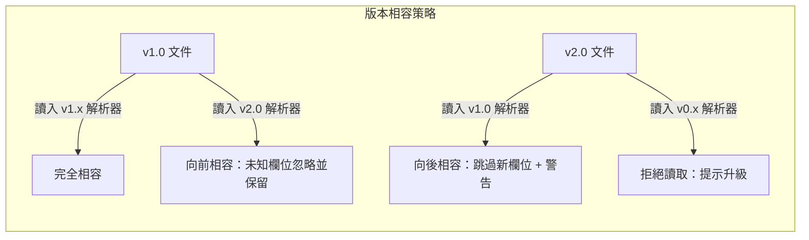
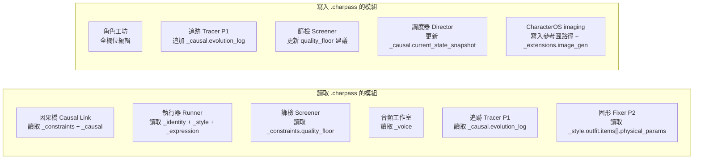

# `.charpass` 文件格式規範 v1.0

> **文件類型**：角色護照（Character Passport）  
> **MIME Type**：`application/x-narratron-charpass`  
> **副檔名**：`.charpass`  
> **編碼**：UTF-8（文本層）+ Binary（資產層）  
> **JSON Schema**：`https://narratron.dev/schemas/charpass/v1.json`（ZIP 內必備 `schema.json`；本 repo 副本：[`narratron/charpass/schema.json`](../narratron/charpass/schema.json)）  
> **程式真相**：`narratron/charpass/`  
> **口號對齊**：*Every Frame Carries Its Past.* 角色護照把「此刻長相」與「為何長這樣」封在同一個自包含容器裡。

這是 **格式層**，不是智能體、不是外掛、不是第六個用戶層畫面。角色實體仍是 `Entity(kind=character)`；護照巢狀寫入 `Entity.payload["charpass"]`，不改凍結表名 `entities` / `shots` / `trace_log` / `assets`。

---

## 一、設計哲學

| 原則 | 說明 |
| :--- | :--- |
| 自包含 | 一個 `.charpass` 文件即包含重建該角色所需的一切 |
| 可遷移 | 跨項目、跨團隊、跨工具（ComfyUI / WebUI）可用 |
| 版本化 | 角色隨劇情演變，護照記錄完整演化歷史 |
| 可驗證 | 內建 SHA-256 校驗，防止篡改 |
| 分層加載 | 輕量元數據可秒讀，重型資產按需載入 |
| 向前相容 | 新版本可讀舊文件，舊版本遇到未知欄位自動跳過 |

### 1.1 本 repo 凍結邊界

| 可做 | 不可做 |
| :--- | :--- |
| 巢狀寫入 `Entity.payload["charpass"]` | 覆蓋 `payload.note` / `continuity_tokens` |
| 類名 `CharpassReader` / `CharpassPacker` | 檔名 `importer.py`；類名 `Importer` / `Exporter` / `Ingestor` / `Editor` |
| Dashboard **子面板**（角色檢視） | 新增畫面代號（用戶層仍是 Pad / Timeline / Dashboard / Map / Player） |
| 本機 `data/charpasses/` 版本庫 | 新建 Beta `Importer`、劫持 P12 `Exporter`（轉檔） |
| 核心 round-trip `_extensions` | 核心讀改 `_extensions`、執行 ComfyUI、呼叫 `generate()` |

---

## 二、容器結構

`.charpass` 本質是一個 ZIP 壓縮容器（`ZIP_DEFLATED`；L0 無密碼時可直接解壓瀏覽）。內部結構：

```
character_name.charpass
├── manifest.json          ← 核心描述文件（必需）
├── schema.json            ← 本文件遵循的 JSON Schema（必需）
├── assets/                ← 二進位資產目錄
│   ├── identity/          ← 身份相關
│   │   ├── ref_face_001.jpg
│   │   ├── ref_face_002.jpg
│   │   └── face_embedding.bin
│   ├── body/              ← 形體相關
│   │   ├── skeleton_base.json
│   │   └── body_mesh.glb
│   ├── style/             ← 妝造相關
│   │   ├── outfit_ref_001.jpg
│   │   └── texture_normal.png
│   ├── expression/        ← 表情相關
│   │   ├── expr_neutral.png
│   │   └── expr_library.json
│   ├── pose/              ← 姿態相關
│   │   └── pose_library.json
│   └── voice/             ← 聲線相關
│       ├── voice_sample.wav
│       └── voice_embedding.bin
├── causal/                ← 因果歷史
│   └── evolution_log.json
├── thumb/                 ← 縮圖（供文件瀏覽器預覽）
│   ├── thumb_256.png
│   └── thumb_64.png
└── signature.sig          ← 數位簽章（可選；L1 HMAC-SHA256）
```

**舊路徑相容**：既有檔案若使用 `assets/references/`，解析器仍讀取，寫入時優先改走 `assets/identity/` 或 `assets/style/`。

### 2.1 輕量模式（API 傳輸 / 嵌入 State Vault）

當通過 API 傳輸或嵌入 State Vault 時，可使用 Lite 模式：僅傳輸 `manifest.json`，資產以 URL 引用。打包後超過 **50MB** 自動改 Lite 再打包。

```json
{
  "schema": "https://narratron.dev/schemas/charpass/v1.json",
  "_mode": "lite",
  "_asset_base_url": "s3://narratron-assets/char_001/",
  "_meta": { "mode": "lite" }
}
```

`_mode` 與 `_meta.mode` 必須一致（`full` | `lite`）。舊檔只有 `_meta.mode` 時，讀入後補寫 `_mode`。

---

## 三、`manifest.json` 完整 Schema

### 3.0 頂層結構

```json
{
  "schema": "https://narratron.dev/schemas/charpass/v1.json",
  "_mode": "full",
  "_asset_base_url": null,
  "_meta": {},
  "_identity": {},
  "_body": {},
  "_style": {},
  "_expression": {},
  "_pose": {},
  "_physics": {},
  "_voice": {},
  "_causal": {},
  "_constraints": {},
  "_extensions": {}
}
```

未知欄位 **不報錯、不丟棄、原樣保留**（round-trip safe）。根物件鍵名以下底線分層。

### 3.1 `_meta` — 元數據

```json
{
  "_meta": {
    "format_version": "1.0.0",
    "charpass_id": "cp_a3f8b2c1-7d4e-4f9a-b123-456789abcdef",
    "character_name": "林默",
    "character_alias": ["Lin Mo", "The Silent One"],
    "created_at": "2026-08-15T14:32:00+08:00",
    "updated_at": "2026-08-19T09:15:00+08:00",
    "created_by": "user_director_01",
    "project_id": "proj_noir_city",
    "tags": ["主角", "男性", "30-40歲", "PTSD"],
    "description": "沉默寡言的前刑警，左手有舊傷，習慣性低頭。",
    "thumbnail": "thumb/thumb_256.png",
    "license": "project_internal",
    "checksum": "sha256:e3b0c44298fc1c149afbf4c8996fb92427ae41e4649b934ca495991b7852b855",
    "parent_charpass_id": null,
    "generation_count": 47
  }
}
```

| 欄位 | 類型 | 必需 | 說明 |
| :--- | :--- | :---: | :--- |
| `format_version` | string | ✅ | 語義化版本號，用於相容性判斷 |
| `charpass_id` | string(UUID) | ✅ | 全局唯一標識 |
| `character_name` | string | ✅ | 角色顯示名稱 |
| `character_alias` | string[] | ❌ | 別名列表 |
| `created_at` | ISO8601 | ✅ | 創建時間 |
| `updated_at` | ISO8601 | ✅ | 最後修改時間 |
| `created_by` | string | ✅ | 創建者 ID |
| `project_id` | string | ✅ | 所屬項目 |
| `tags` | string[] | ❌ | 標籤（供搜索） |
| `description` | string | ❌ | 自然語言描述 |
| `thumbnail` | string(path) | ❌ | 縮圖路徑 |
| `license` | enum | ❌ | `project_internal` / `team_shared` / `public` / `encrypted` |
| `checksum` | string | ✅ | 容器正規化 SHA-256（見 §4.1） |
| `parent_charpass_id` | string/null | ❌ | 若為衍生角色，指向父護照 |
| `generation_count` | int | ❌ | 該角色已被生成多少次（統計用） |

**本 repo 額外欄位**（寫入時保留，舊檔相容）：`entity_id`、`encryption_level`（0–3 或 `L0`–`L3`）、`mode`、`size_bytes`、`parser_version`、`archived`。

### 3.2 `_identity` — 身份層

```json
{
  "_identity": {
    "ref_images": [
      {
        "path": "assets/identity/ref_face_001.jpg",
        "angle": "front",
        "weight": 0.4,
        "note": "正面中性表情"
      },
      {
        "path": "assets/identity/ref_face_002.jpg",
        "angle": "three_quarter_left",
        "weight": 0.3,
        "note": "左側45度"
      },
      {
        "path": "assets/identity/ref_face_003.jpg",
        "angle": "profile_right",
        "weight": 0.3,
        "note": "右側面"
      }
    ],
    "face_embedding": {
      "path": "assets/identity/face_embedding.bin",
      "model": "insightface_r100",
      "dimension": 512,
      "dtype": "float32"
    },
    "ip_adapter": {
      "enabled": true,
      "model": "ip-adapter-faceid-plusv2",
      "weight": 0.85,
      "noise_aug": 0.02
    },
    "blend": {
      "mode": "single",
      "sources": [],
      "ethnicity_bias": 0.0,
      "gender_spectrum": 0.72,
      "age_offset": 0,
      "age_visual": 35
    },
    "lock_rules": {
      "face_consistency_threshold": 0.88,
      "allow_expression_change": true,
      "allow_aging_progression": true,
      "forbidden_regions": []
    }
  }
}
```

| 欄位 | 說明 |
| :--- | :--- |
| `ref_images[].angle` | 枚舉：`front` / `three_quarter_left` / `three_quarter_right` / `profile_left` / `profile_right` / `top_down` / `low_angle` |
| `ref_images[].weight` | 該參考圖在融合時的權重（所有 weight 總和應 = 1.0） |
| `face_embedding.model` | 嵌入向量使用的模型名稱 |
| `ip_adapter.weight` | 0.0~1.0，越高越嚴格鎖定身份 |
| `blend.mode` | `single`（單一來源）/ `multi`（混合多張臉） |
| `blend.gender_spectrum` | 0.0 = 完全女性化，1.0 = 完全男性化 |
| `lock_rules.face_consistency_threshold` | `Screener` 質檢時的最低相似度閾值 |

### 3.3 `_body` — 形體層

```json
{
  "_body": {
    "template": "athletic_male",
    "skeleton": {
      "path": "assets/body/skeleton_base.json",
      "format": "openpose_18",
      "head_ratio": 7.5,
      "height_cm": 178,
      "weight_kg": 72
    },
    "proportions": {
      "shoulder_width": 1.05,
      "hip_width": 0.95,
      "arm_length": 1.0,
      "leg_length": 1.02,
      "neck_length": 0.98,
      "hand_size": 1.0,
      "foot_size": 1.0
    },
    "limb_thickness": {
      "arms": 1.1,
      "forearms": 1.05,
      "thighs": 1.0,
      "calves": 0.95,
      "torso": 1.0,
      "neck": 1.0
    },
    "posture_defaults": {
      "spine_curve": "slight_forward_lean",
      "shoulder_state": "slightly_dropped",
      "head_tilt": -3,
      "note": "習慣性微微前傾，肩膀略沉，頭微低"
    },
    "mesh": {
      "path": "assets/body/body_mesh.glb",
      "format": "glTF_2.0",
      "polycount": 12500
    },
    "skin_tone": {
      "base_hex": "#C8A882",
      "undertone": "warm",
      "freckle_density": 0.1,
      "tan_lines": []
    }
  }
}
```

| 欄位 | 說明 |
| :--- | :--- |
| `template` | 預設體型：`slim_female` / `athletic_male` / `heavy_male` / `elderly_female` / `child` / `custom` |
| `skeleton.format` | 骨架格式：`openpose_18` / `dwp_17` / `mediapipe_33` / `smpl_x` |
| `proportions` | 各部位比例係數（1.0 = 標準） |
| `posture_defaults` | 角色「靜止時」的習慣姿態 |
| `posture_defaults.head_tilt` | 角度（度），負值 = 低頭 |

### 3.4 `_style` — 妝造與材質層

```json
{
  "_style": {
    "outfit": {
      "description": "舊白色亞麻襯衫，深藍色磨損牛仔褲，棕色舊皮帶",
      "ref_images": [
        {
          "path": "assets/style/outfit_ref_001.jpg",
          "note": "全身正面穿搭參考"
        }
      ],
      "items": [
        {
          "slot": "upper_body",
          "name": "亞麻襯衫",
          "material": "linen",
          "color_hex": "#F5F0E8",
          "condition": "worn",
          "physical_params": {
            "reflectance": 0.05,
            "roughness": 0.9,
            "wrinkle_intensity": 0.7,
            "translucency": 0.1
          }
        }
      ]
    },
    "hair": {
      "style": "short_messy",
      "color_hex": "#1A1A1A",
      "length_cm": 6,
      "texture": "straight_slightly_wavy",
      "physics": {
        "wind_response": 0.4,
        "gravity_droop": 0.2,
        "wet_clump": 0.6
      }
    },
    "makeup": {
      "type": "none",
      "intensity": 0.0,
      "regions": []
    },
    "damage_regions": [
      {
        "id": "dmg_001",
        "area": "left_forearm",
        "type": "old_scar",
        "intensity": 0.7,
        "since_scene": 3,
        "description": "左前臂一道5cm舊疤，已癒合但微微凸起"
      }
    ],
    "accessories": [
      {
        "slot": "wrist_left",
        "name": "舊手錶",
        "description": "表面有裂紋的機械錶",
        "binding": "fixed_to_wrist"
      }
    ]
  }
}
```

| 欄位 | 說明 |
| :--- | :--- |
| `outfit.items[].slot` | 枚舉：`upper_body` / `lower_body` / `outerwear` / `footwear` / `headwear` / `accessory_*` |
| `outfit.items[].condition` | 枚舉：`pristine` / `new` / `worn` / `faded_worn` / `torn` / `bloodied` / `burned` |
| `physical_params.reflectance` | 0.0（完全啞光）~ 1.0（鏡面反射） |
| `damage_regions[].since_scene` | 該傷痕從第幾場開始出現（因果綁定） |
| `hair.physics.wind_response` | 0.0 = 完全不動，1.0 = 極度飄動 |

`damage_regions[]` 與 `Parser` 的 `continuity_tokens`（`scar` / `bandage` / `rust` / `wear` / `bloodstain`）雙向同步，**只補不刪**。投影時可同時帶 `token`（給 Parser）與 `id` / `area` / `type`（給工坊）。

#### 3.4.1 `character_style` — 角色風格

視覺畫風、生圖提示詞、敘事語氣與參考圖錨點寫在同一層，供 CharacterOS 第三方生圖組 prompt。參考圖本身仍走既有路徑，不在 `character_style` 重複巢狀。

```json
{
  "_style": {
    "character_style": {
      "visual": {
        "medium": "cinematic realism",
        "aesthetic": "冷調都市夜色",
        "color_palette": ["#1B1F2A", "#C4B7A6"],
        "lighting": "側光硬陰影",
        "camera": "50mm, shallow depth of field",
        "keywords": ["weathered", "restrained"]
      },
      "art_prompt": {
        "positive": "highly detailed face, consistent identity",
        "negative": "cartoon, extra fingers, watermark",
        "strength": 1.0,
        "template": ""
      },
      "narrative": {
        "tone": "克制、寡言",
        "speech_pattern": "短句、先停頓再答",
        "diction": "口語但不隨便",
        "register": "casual-restrained",
        "sample_lines": ["……我知道了。"]
      },
      "consistency_notes": "臉型與標誌性傷痕必須跨鏡頭一致"
    }
  }
}
```

| 欄位 | 說明 |
| :--- | :--- |
| `visual.medium` | 畫種／媒介（寫實、動漫、水彩等） |
| `visual.aesthetic` | 整體美學與時代感 |
| `visual.color_palette` | 主色 hex 列表 |
| `art_prompt.positive` / `negative` | 拼進第三方生圖 API 的正／負向提示 |
| `art_prompt.template` | 可含 `{name}` / `{purpose}` 的模板 |
| `narrative.*` | 對白與文風（給文字模型，不進生圖除非 `extra` 指定） |
| `consistency_notes` | 人臉／服裝一致性備註 |
| `_style.reference_images[]` | 風格／全身錨點 |
| `_identity.ref_images[]` | 人臉一致性錨點 |
| `_style.outfit.ref_images[]` | 服裝錨點 |

組裝實作：`narratron/charpass/style_prompt.py`（**只組 prompt，不呼叫 `generate()`**）。

### 3.5 `_expression` — 表情層

```json
{
  "_expression": {
    "base_emotion": "suppressed_grief",
    "micro_asymmetry": 0.3,
    "resting_face": {
      "brow_position": -0.1,
      "eye_openness": 0.85,
      "gaze_direction": "down_left",
      "mouth_state": "closed_slight_frown",
      "jaw_tension": 0.6
    },
    "au_library": {
      "default_set": [
        {"au": "AU1", "name": "Inner Brow Raiser", "intensity": 0.3},
        {"au": "AU4", "name": "Brow Lowerer", "intensity": 0.5}
      ],
      "custom_presets": [
        {
          "name": "PTSD_Flashback",
          "trigger": "causal_event_trigger",
          "au_set": [{"au": "AU1", "intensity": 0.9}],
          "duration_hint": "2-5s",
          "note": "瞳孔放大、嘴唇微張、眉毛上揚"
        }
      ]
    },
    "gaze": {
      "default_target": "camera_left_low",
      "tracking_mode": "fixed",
      "saccade_frequency": 0.3,
      "blink_rate_per_min": 12
    },
    "lip_sync": {
      "neutral_mouth_shape": "rest_closed",
      "openness_range": [0.0, 0.85],
      "dental_visibility": 0.3
    }
  }
}
```

| 欄位 | 說明 |
| :--- | :--- |
| `base_emotion` | 角色的「底色情緒」，無特殊劇情時的預設 |
| `micro_asymmetry` | 0.0 = 完全對稱（不自然），0.3 = 輕微不對稱（真實），1.0 = 誇張 |
| `au_library.default_set` | 靜止狀態下的 AU 組合 |
| `au_library.custom_presets` | 可觸發的表情預設（綁定因果事件或手動觸發） |
| `gaze.saccade_frequency` | 眼球微動頻率（0=死盯，1=頻繁掃視） |

### 3.6 `_pose` — 姿態層

```json
{
  "_pose": {
    "default_pose": {
      "skeleton_path": "assets/pose/neutral_stand.json",
      "format": "openpose_18",
      "description": "微前傾站立，雙手自然下垂，重心偏左"
    },
    "pose_library": [
      {
        "id": "pose_walk_tired",
        "name": "疲憊行走",
        "skeleton_path": "assets/pose/walk_tired.json",
        "loop": true,
        "fps": 24,
        "frames": 48,
        "note": "肩膀下沉，步伐拖沓"
      }
    ],
    "movement_style": {
      "speed_factor": 0.8,
      "fluidity": 0.6,
      "weight_shift": "heavy",
      "note": "動作偏慢，有重量感，不輕盈"
    },
    "interaction_constraints": {
      "personal_space_radius_cm": 60,
      "touch_aversion": ["face", "left_arm"],
      "note": "不喜被觸碰臉部和左臂（PTSD相關）"
    }
  }
}
```

### 3.7 `_physics` — 物理層

```json
{
  "_physics": {
    "skin": {
      "detail_level": 0.8,
      "pore_visibility": 0.6,
      "subsurface_scattering": 0.7,
      "wrinkle_depth": 0.5,
      "elasticity": 0.7,
      "note": "略粗糙的膚質，非塑膠感"
    },
    "cloth": {
      "simulation_mode": "auto_by_material",
      "wind_sensitivity": 0.5,
      "gravity_response": 0.8,
      "collision_with_body": true,
      "wrinkle_memory": 0.6
    },
    "hair": {
      "simulation_mode": "strand_based",
      "strand_count_hint": "medium",
      "static_electricity": 0.1,
      "wet_behavior": {
        "clump_factor": 0.7,
        "darkening": 0.3,
        "weight_increase": 0.4
      }
    },
    "fluids": {
      "sweat": {
        "enabled": true,
        "trigger": "exertion_or_stress",
        "regions": ["forehead", "upper_lip", "palms"],
        "flow_speed": 0.3
      },
      "tears": {
        "enabled": true,
        "trigger": "causal_event",
        "flow_path": "inner_corner_to_chin",
        "volume": "single_drop"
      },
      "blood": {
        "enabled": true,
        "trigger": "causal_event",
        "color_hex": "#8B0000",
        "viscosity": 0.7
      }
    },
    "lighting_response": {
      "skin_specular": 0.3,
      "eye_reflection": true,
      "shadow_softness": 0.6
    }
  }
}
```

### 3.8 `_voice` — 聲線層

```json
{
  "_voice": {
    "enabled": true,
    "ref_audio": {
      "path": "assets/voice/voice_sample.wav",
      "duration_sec": 12.5,
      "sample_rate": 44100,
      "channels": 1
    },
    "voice_embedding": {
      "path": "assets/voice/voice_embedding.bin",
      "model": "elevenlabs_v2",
      "dimension": 256
    },
    "characteristics": {
      "pitch": "low_baritone",
      "speed_factor": 0.85,
      "breathiness": 0.3,
      "roughness": 0.5,
      "accent": "neutral_mandarin",
      "habitual_pause_ms": 400,
      "note": "低沉沙啞，語速偏慢，每句之間有停頓習慣"
    },
    "emotional_range": {
      "neutral": {"pitch_shift": 0, "speed_shift": 0},
      "angry": {"pitch_shift": -0.1, "speed_shift": 0.15, "roughness_boost": 0.3},
      "sad": {"pitch_shift": -0.05, "speed_shift": -0.1, "breathiness_boost": 0.2},
      "whisper": {"volume": -12, "breathiness": 0.9}
    }
  }
}
```

### 3.9 `_causal` — 因果演化歷史

```json
{
  "_causal": {
    "evolution_log": [
      {
        "scene": 1,
        "event": "initial_state",
        "changes": {},
        "note": "初始狀態"
      },
      {
        "scene": 3,
        "event": "left_arm_injury",
        "changes": {
          "_style.damage_regions": ["+dmg_001"],
          "_pose.interaction_constraints.touch_aversion": ["+left_arm"],
          "_expression.au_library.custom_presets": ["+PTSD_Flashback"]
        },
        "description": "左前臂被碎玻璃割傷，留下疤痕，此後抗拒被觸碰左臂",
        "permanent": true
      },
      {
        "scene": 7,
        "event": "bar_fight",
        "changes": {
          "_style.damage_regions": ["+dmg_002"],
          "_style.outfit.items[0].condition": "worn→torn_sleeve"
        },
        "description": "酒吧衝突，右手指關節淤青，襯衫左袖撕裂",
        "permanent": false,
        "heal_scene": 12
      }
    ],
    "current_state_snapshot": {
      "as_of_scene": 10,
      "active_damage": ["dmg_001", "dmg_002"],
      "outfit_condition": {"upper": "torn_sleeve_wet", "lower": "soaked"},
      "emotional_state": "suppressed_grief_trending_rage"
    }
  }
}
```

| 欄位 | 說明 |
| :--- | :--- |
| `evolution_log[].changes` | JSON Patch 風格的增量（`+` 添加，`-` 移除，`→` 修改）。亦接受陣列 `{op, path, value}` 或字串 `+ path value` |
| `evolution_log[].permanent` | `true` = 永久改變（疤痕），`false` = 臨時（淤青會消退） |
| `evolution_log[].heal_scene` | 臨時狀態在第幾場恢復 |
| `current_state_snapshot` | 快速讀取當前狀態，無需重放全部歷史 |

導入時 `target_scene_offset` 加到 log 條目的 `scene`（及舊欄位 `scene_index`）。

路徑支援 `items[0]` 與 `items[*]`（套用到陣列每一項）。

### 3.10 `_constraints` — 生成約束規則

```json
{
  "_constraints": {
    "must_always": [
      "左手腕有舊手錶",
      "左前臂有5cm舊疤（scene>=3）",
      "眼神避免直視鏡頭（除非劇本明確要求）"
    ],
    "must_never": [
      "露出笑容（scene 1-15）",
      "右手持物（慣用左手）",
      "頭髮完全整齊（必須有凌亂感）"
    ],
    "conditional": [
      {
        "if": "scene >= 7 AND scene <= 12",
        "then": "右手指關節有淤青"
      }
    ],
    "quality_floor": {
      "face_consistency_min": 0.88,
      "body_proportion_tolerance": 0.05,
      "outfit_color_delta_e_max": 4.0
    }
  }
}
```

舊欄位 `required` / `forbidden` / `continuity` 讀入時分別對映到 `must_always` / `must_never` / 連續性 token 清單，寫出時兩邊都保留。

### 3.11 `_extensions` — 擴展區（開放）

```json
{
  "_extensions": {
    "comfyui_workflow": {
      "path": "extensions/comfyui_workflow.json",
      "version": "0.2"
    },
    "unreal_metahuman": {
      "path": "extensions/metahuman_config.json",
      "version": "5.4"
    },
    "custom_plugin_data": {
      "my_studio_tool": {
        "key": "value"
      }
    }
  }
}
```

`_extensions` 為完全開放區域，任何第三方工具可在此寫入自己的數據，**Narratron 核心不會讀取或修改此區域**。舊鍵 `comfyui` 與 `comfyui_workflow` 並存時皆原樣保留。建議預留 `image_gen` 給 CharacterOS 第三方生圖引用（provider / model / last_asset_paths）；核心只 round-trip，不執行。

---

## 四、二進位資產規範

| 資產類型 | 格式 | 說明 |
| :--- | :--- | :--- |
| 參考圖 | JPEG / PNG / WebP | 長邊 ≤ 2048px，sRGB 色彩空間 |
| 面部嵌入向量 | Binary `.bin`（float32 LE） | 依模型不同，維度在 manifest 中聲明 |
| 骨架數據 | JSON（OpenPose / DWP 格式） | 關節點座標 + 置信度 |
| 3D 網格 | glTF 2.0 `.glb` | 可選，用於 3DGS 管線 |
| 聲線樣本 | WAV 44.1kHz 16bit Mono | 時長 5~30 秒 |
| 聲線嵌入向量 | Binary `.bin`（float32 LE） | 依 TTS 模型不同 |
| 縮圖 | PNG | 256×256 與 64×64 兩級 |

### 4.1 Checksum（SHA-256）

- 範圍：ZIP 成員的正規化雜湊，**不是**把 checksum 寫進 ZIP 再雜湊自己。
- **排除** `_meta.checksum` 與 `signature.sig`。
- `manifest.json` 先去掉 checksum 再做 canonical JSON（`sort_keys`、無多餘空白）。
- 寫入形式：`sha256:<hex>`。

這樣才能在寫入 checksum 之後仍通過校驗，並覆蓋容器內所有文本層與資產層。

---

## 五、版本相容性規則



規則：

- **主版本號**差 1：警告，未知欄位原樣保留，繼續讀取。
- **主版本號**差 ≥ 2：拒絕並提示升級。
- **次版本號**（`x.1`）變化 = 新增可選欄位，舊解析器跳過即可。
- **修訂號**（`x.x.1`）變化 = 文檔修正，無結構影響。
- 解析器遇到未知欄位：不報錯、不丟棄、原樣保留（round-trip safe）。

本 repo 解析器主版本 = `1`（`PARSER_VERSION=1.0.0`）。

---

## 六、安全與加密

金鑰由請求帶入，**不內建後門**。

| 等級 | 機制 | 適用場景 |
| :--- | :--- | :--- |
| L0 明文 | 無加密，ZIP 直接解壓 | 內部開發、開源角色 |
| L1 校驗 | SHA-256 checksum + `signature.sig`（HMAC-SHA256） | 團隊共享，防篡改 |
| L2 加密 | AES-256-GCM 加密 `assets/`，manifest 明文 | 跨團隊授權使用 |
| L3 全加密 | 整個 ZIP 加密（魔數 `NRTNCP3`），需密鑰解鎖 | 商業 IP 保護 |

L2 加密後仍可在無金鑰時讀取 manifest（Lite 元數據）。讀資產需要金鑰。L2 資產密文魔數為 `NRTNCP2`。

加密時 `manifest.json` 中增加：

```json
{
  "_meta": {
    "license": "encrypted",
    "encryption": {
      "method": "AES-256-GCM",
      "key_id": "key_narratron_team_01",
      "iv": "base64_encoded_iv_here"
    },
    "encryption_level": "L2"
  }
}
```

---

## 七、導入 / 導出 API

掛在現有 FastAPI 閘道，前綴 `/api/v1`。既有 `/parse` `/direct` 不變。

### 7.1 導出（Export）

```
POST /api/v1/characters/{char_id}/export
```

Body：

```json
{
  "format": "charpass",
  "mode": "full",
  "include_assets": true,
  "encryption_level": "L0",
  "include_causal_history": true,
  "include_voice": true
}
```

`mode`：`full` | `lite`。`encryption_level`：`L0` | `L1` | `L2` | `L3`。

預設回應為 `.charpass` 二進位（`Content-Type: application/x-narratron-charpass`）。`as_json: true` 時回傳：

```json
{
  "download_url": "file://data/charpasses/{entity_id}/current.charpass",
  "expires_at": null,
  "file_size_bytes": 14582930,
  "checksum": "sha256:..."
}
```

### 7.2 導入（Import）

```
POST /api/v1/projects/{proj_id}/characters/import
```

Body：`multipart/form-data`

- `file`：`.charpass`
- `conflict_strategy`：`create_new` | `merge` | `overwrite`
- `target_scene_offset`：因果場景號偏移（預設 0）
- `confirm`：`overwrite` 時必須 `true`

Response：

```json
{
  "char_id": "char_new_001",
  "status": "imported",
  "warnings": ["voice_embedding model mismatch: expected elevenlabs_v2, got v1"],
  "causal_offset_applied": 0
}
```

### 7.3 衝突處理策略

| 策略 | 行為 |
| :--- | :--- |
| `create_new` | 導入為全新角色，不影響現有 |
| `merge` | 合併到現有同名角色，新增欄位補充，衝突欄位保留現有 |
| `overwrite` | 完全替換現有角色（需二次確認 `confirm=true`） |

### 7.4 本 repo 額外端點

| 方法 | 路徑 | 說明 |
| :--- | :--- | :--- |
| `GET` | `/api/v1/characters/{char_id}/charpass` | Lite manifest |
| `POST` | `/api/v1/characters/{char_id}/charpass` | 工坊寫回（只改 `payload.charpass`） |
| `DELETE` | `/api/v1/characters/{char_id}` | 有 traces 則 409，除非 `archive=true` |

### 7.5 第三方生圖（CharacterOS，非核心）

核心格式層 **不** 呼叫 `generate()`。實際打第三方 API 只發生在 `characteros/imaging/`：

| 方法 | 路徑 | 說明 |
| :--- | :--- | :--- |
| `GET` | `/api/v1/imaging/providers` | 列出 `null` / `http` / `openai` |
| `POST` | `/api/v1/imaging/generate` | 依 manifest 或本機 `entity_id` 生圖 |
| `POST` | `/api/v1/characters/{id}/images` | 依 Profile 風格生必要參考圖 |

`_extensions.image_gen` 只存 provider / model / 上次產出路徑，核心 round-trip 保留、不執行。Provider 以環境變數切換，見 `.env.example`。

被 `trace_log` 引用的角色只准歸檔（`payload.archived=true` / `_meta.archived=true`），不准刪。本機版本庫每次寫入保留最近 **5** 版。

---

## 八、完整範例文件（精簡版）

```json
{
  "schema": "https://narratron.dev/schemas/charpass/v1.json",
  "_meta": {
    "format_version": "1.0.0",
    "charpass_id": "cp_a3f8b2c1-7d4e-4f9a-b123-456789abcdef",
    "character_name": "林默",
    "created_at": "2026-08-15T14:32:00+08:00",
    "updated_at": "2026-08-19T09:15:00+08:00",
    "created_by": "user_director_01",
    "project_id": "proj_noir_city",
    "tags": ["主角", "男性", "PTSD"],
    "checksum": "sha256:e3b0c44298fc1c149afbf4c8996fb92427ae41e4649b934ca495991b7852b855"
  },
  "_identity": {
    "ref_images": [
      {"path": "assets/identity/ref_face_001.jpg", "angle": "front", "weight": 1.0}
    ],
    "ip_adapter": {"enabled": true, "weight": 0.85},
    "blend": {"gender_spectrum": 0.72, "age_visual": 35},
    "lock_rules": {"face_consistency_threshold": 0.88}
  },
  "_body": {
    "template": "athletic_male",
    "skeleton": {"format": "openpose_18", "head_ratio": 7.5, "height_cm": 178},
    "posture_defaults": {"spine_curve": "slight_forward_lean", "head_tilt": -3}
  },
  "_style": {
    "outfit": {
      "items": [
        {"slot": "upper_body", "name": "亞麻襯衫", "material": "linen", "condition": "worn"},
        {"slot": "lower_body", "name": "牛仔褲", "material": "denim", "condition": "faded_worn"}
      ]
    },
    "character_style": {
      "visual": {"medium": "cinematic realism", "aesthetic": "冷調都市夜色"},
      "art_prompt": {"positive": "consistent identity", "negative": "cartoon, watermark"},
      "narrative": {"tone": "克制、寡言"}
    },
    "damage_regions": [
      {"id": "dmg_001", "area": "left_forearm", "type": "old_scar", "since_scene": 3}
    ]
  },
  "_expression": {
    "base_emotion": "suppressed_grief",
    "micro_asymmetry": 0.3,
    "au_library": {
      "default_set": [
        {"au": "AU4", "intensity": 0.5},
        {"au": "AU15", "intensity": 0.2}
      ]
    }
  },
  "_constraints": {
    "must_always": ["左手腕有舊手錶", "左前臂有舊疤"],
    "must_never": ["露出笑容（scene 1-15）"],
    "quality_floor": {"face_consistency_min": 0.88}
  },
  "_causal": {
    "evolution_log": [
      {"scene": 3, "event": "left_arm_injury", "permanent": true},
      {"scene": 7, "event": "bar_fight", "permanent": false, "heal_scene": 12}
    ]
  }
}
```

---

## 九、與系統各模組的讀寫關係



### 9.1 State Vault 橋接

- 護照 ↔ `Entity.payload.charpass`
- 參考圖／聲線 → 表 `assets`（不改表名）
- `trace_log` 可補進 `evolution_log`
- `note` 永不被護照覆蓋
- `Parser._put_entity` 合併時保留既有 `payload["charpass"]`。劇本仍寫 `note` / `continuity_tokens`。若已有護照，新傷痕 token 投影進 `_style.damage_regions`，不刪歷史。

角色工坊是 `Dashboard` 內的角色檢視子面板，不是獨立路由。聚焦子面板時快捷鍵：`S` 儲存、`E` 導出、`I` 導入。

---

## 十、文件命名與存儲規範

| 項目 | 規範 |
| :--- | :--- |
| 檔名 | `{character_name}_{charpass_id_short}.charpass`（如 `林默_a3f8b2.charpass`） |
| `charpass_id_short` | `charpass_id` 去掉連字號與可選 `cp_` 前綴後前 6 碼 |
| 存儲位置（本機） | `data/charpasses/{entity_id}/current.charpass` |
| 本機可讀護照 | `data/charpasses/{entity_id}/current.charpass`（L0 可讀 JSON，由 `CharpassStore` 維護；**請在 IDE 開此檔**） |
| 本機 ZIP 快照 | `data/charpasses/{entity_id}/history/*.charpass`（匯出／備份用二進位） |
| 解包工具 | `python scripts/inspect_charpass.py data/charpasses/{entity_id}` 或 `--all` |
| 存儲位置（雲端） | `s3://narratron-{project}/charpasses/{charpass_id}/` |
| 最大文件大小 | 50MB（超出時資產自動轉為 URL 引用，進入 Lite 模式） |
| 備份策略 | 每次修改自動保留前 5 個版本（版本號遞增） |
| 刪除保護 | 被 ≥1 個鏡頭 / `trace_log` 引用的角色不可刪除，僅可歸檔 |

---

## 附錄 A、舊欄位對映（v1.0 讀寫皆接受）

為避免既有 `Entity.payload.charpass` 失真，下列舊鍵與新鍵雙向同步。寫出時兩邊都保留。

| 舊鍵 | 新鍵 |
| :--- | :--- |
| `_identity.name` | `_meta.character_name` |
| `_identity.aliases` | `_meta.character_alias` |
| `_identity.gender_spectrum` / `face_threshold` | `_identity.blend.gender_spectrum` / `_identity.lock_rules.face_consistency_threshold` |
| `_style.ip_adapter_weight` | `_identity.ip_adapter.weight` |
| `_style.reference_images[]` | `_identity.ref_images[]`（人臉）或 `_style.outfit.ref_images[]` |
| `_style.damage_regions[].token` / `region` | `type` / `area`（`token` 仍給 Parser） |
| `_style.clothing[]` | `_style.outfit.items[].name` |
| `_constraints.required` / `forbidden` | `must_always` / `must_never` |
| `_causal.evolution_log[].scene_index` / `cause` | `scene` / `event` |
| `_extensions.comfyui` | `_extensions.comfyui_workflow` |
| `_meta.mode` | `_mode` |

---

## 附錄 B、後續可獨立成文的方向

本規範已覆蓋從結構、安全到 API 的完整生命週期。下列主題可另開文件，不阻塞 v1.0：

1. 可直接用於驗證的機器可讀 `schema.json`（已內嵌於 ZIP 與 `narratron/charpass/schema.json`）
2. 角色工坊 GUI 互動原型（滑桿 / 拖拽 / 快捷鍵；畫面代號仍是 `Dashboard`）
3. 解析器實作細節（`CharpassReader` / `CharpassPacker`，見 `narratron/charpass/`）
4. 與 ComfyUI 的橋接（只寫 `_extensions.comfyui_workflow`；核心不執行、不呼叫 `generate()`）
5. 第三方生圖（只寫 `_extensions.image_gen`；執行在 CharacterOS `imaging`，核心不呼叫 `generate()`）
