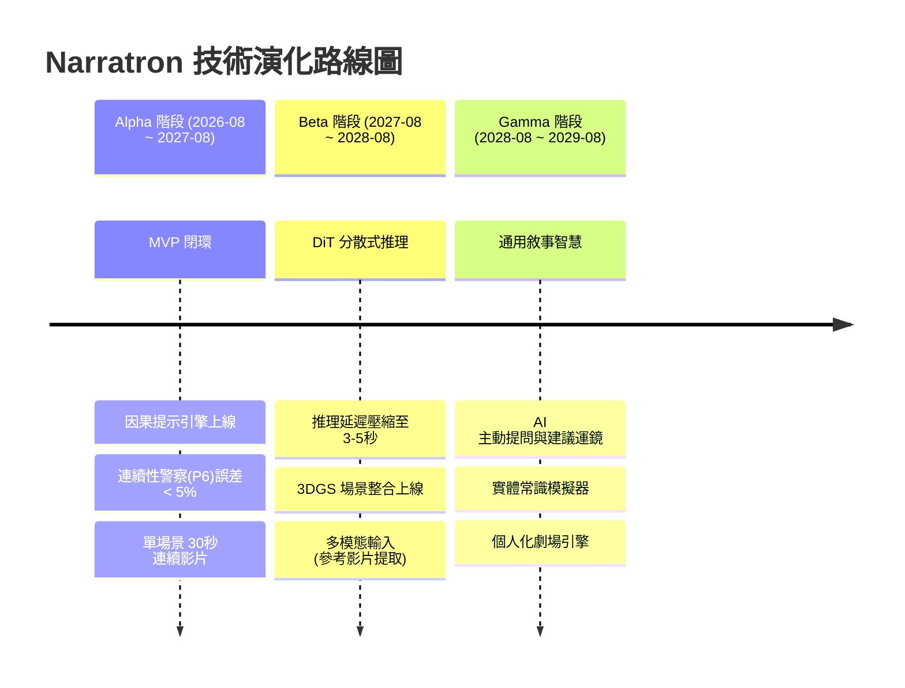

# 分階段技術路線圖

> 白皮書原文：[`whitepaper-v2.md`](whitepaper-v2.md) §5  
> 總跨度：36 個月（Alpha → Beta → Gamma）  
> 日曆錨點：**2026-08-18**（見 [`README.md`](../README.md) 模組實作時間表）

## 本 repo 目前停在哪

| 項目 | 狀態 |
| :--- | :--- |
| 白皮書 v2.0 架構凍結 | **已完成** |
| 命名、目錄、介面契約 | **已完成** |
| Alpha Q1：`State Vault` / `Trace Log` 讀寫 | **已完成**（預設記憶體；`VAULT_BACKEND=postgres` 走 JSONB） |
| Alpha Q1：`Parser` / `Director` 拆解 | **已完成** |
| Alpha Q1：參考圖資產庫 + IP-Adapter 佇列 | **已完成**（不呼叫 GPU） |
| Postgres 實機驗收、分鏡品質打磨 | **進行中**（Q1 剩餘） |
| Causal Link / Compressor / Logic Core | **未開始**（Alpha Q2） |
| Keeper / Screener CV / 任何模型 generate | **未開始** |
| 前端五畫面 | **僅文件** |

下一步唯一合法工作：打磨 Q1（Postgres 連線驗收），然後才進 Q2 演算法。不得跳去 Beta/Gamma 名稱建檔。

---

## 路線總覽

---

## Alpha（第 1–12 月 / 2026-08-18 ~ 2027-08-17）：連續性征服

**核心目標**：建立穩固的因果閉環，解決長片 AI 穿幫問題。

| 季度 | 日曆 | 主題 | 交付 | KPI / 里程碑 |
| :--- | :--- | :--- | :--- | :--- |
| Q1 (1–3) | 2026-08-18 ~ 2026-11-17 | 地基與解析 | `State Vault` + `Trace Log`；`Parser` / `Director`；參考圖資產庫；IP-Adapter 排隊 | Vault 可初始化角色/道具/場景 |
| Q2 (4–6) | 2026-11-18 ~ 2027-02-17 | 因果閉環打通 | `Causal Link` + `Compressor`；`Screener` v1.0 | 傷痕/道具連續性誤差 **< 5%**（SSIM） |
| Q3 (7–9) | 2027-02-18 ~ 2027-05-17 | 外掛生態擴充 | `Router`（真選池）+ `Recycler`；Wan2.1 / LTX 本地 720p | 成本降低 **60%** |
| Q4 (10–12) | 2027-05-18 ~ 2027-08-17 | 工業化驗證 | `Muxer` + `Exporter`；5–10 分鐘因果連續短劇樣片 | 衣物/傷痕穿幫率趨近於零 |

口語「連續性警察」= P6 `Screener`，程式代號不得改名。

---

## Beta（第 13–24 月 / 2027-08-18 ~ 2028-08-17）：即時化與 3D 空間突破

**核心目標**：突破 2D 像素生成限制，引入 3D 空間計算。

| 季度 | 日曆 | 主題 | 交付 | KPI / 里程碑 |
| :--- | :--- | :--- | :--- | :--- |
| Q1 (13–15) | 2027-08-18 ~ 2027-11-17 | 基礎模型迭代 | DiT + Consistency Models | 草案模式延遲 **3–5 秒** |
| Q2 (16–18) | 2027-11-18 ~ 2028-02-17 | 3DGS 整合 | 場景先成高斯點雲再渲染 | 鏡頭移動背景扭曲趨近於零 |
| Q3 (19–21) | 2028-02-18 ~ 2028-05-17 | 多模態輸入 | `Importer` 外掛（屆時才建檔）；部署 `Alt Core` | 參考影片 → 內部控制訊號 |
| Q4 (22–24) | 2028-05-18 ~ 2028-08-17 | 封測 | 100 位專業創作者；拖曳改鏡頭角度 | 運鏡自由度提升 10 倍 |

---

## Gamma（第 25–36 月 / 2028-08-18 ~ 2029-08-17）：通用敘事智慧 (GNI)

**核心目標**：從工具進化為具備物理常識與創作建議的 AI 導演。

| 時段 | 日曆 | 主題 | 交付 | KPI |
| :--- | :--- | :--- | :--- | :--- |
| Q1–Q2 (25–30) | 2028-08-18 ~ 2029-02-17 | 自主拍攝代理 | `Director` 主動提問；實體常識模擬器 | 推倒水杯可自動補物理序列 |
| Q3–Q4 (31–36) | 2029-02-18 ~ 2029-08-17 | 個人化劇場與終端輕量化 | 個人化敘事引擎；邊緣蒸餾；雲端 4K | 創作者輸入 10%，系統補 90% |

---

## 本階段明確不做

- Causal Link / Compressor / Logic Core 演算法（Q2）
- Keeper 不斷檔提示、Screener CV（Q2）
- 任何模型 `generate()` API 呼叫（Q3）
- Muxer 後期合成與樣片（Q4）
- 前端五畫面實作
- 提前建立 `Importer` 或 Gamma 模組檔
