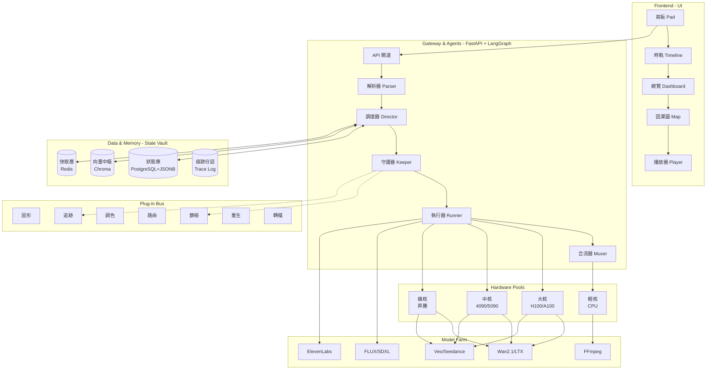
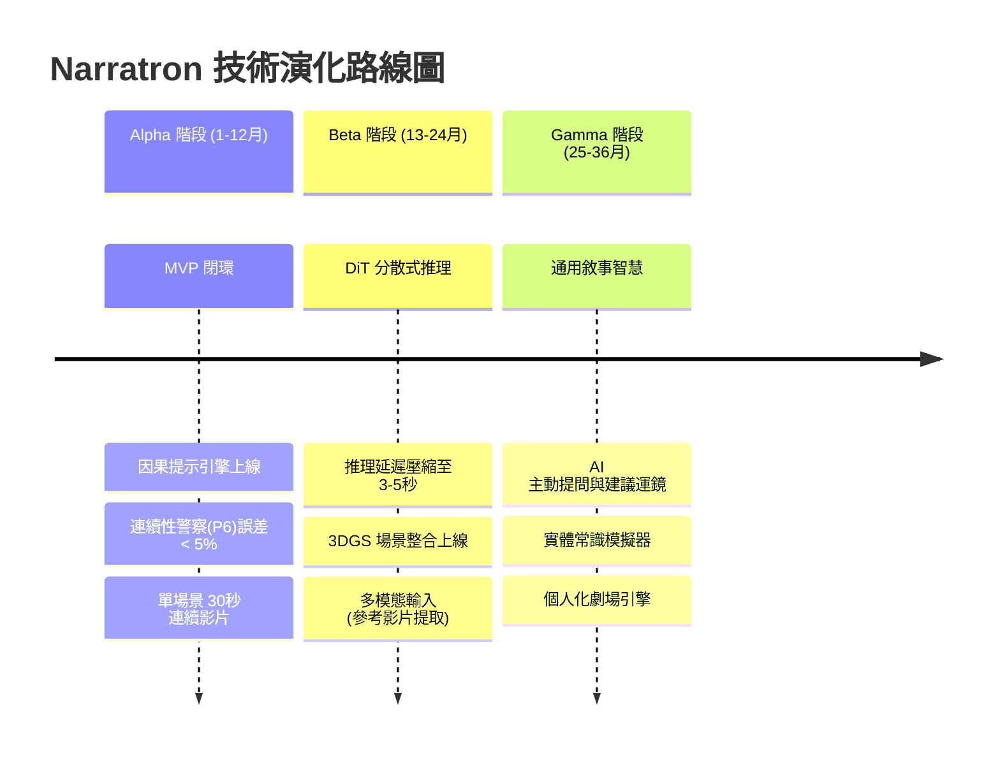

# 技術白皮書：Narratron —— AI 影視級因果敘事生成平台
**版本**：v2.0 (架構凍結版)　｜　**機密等級**：公開預覽　｜　**核心口號**：*Every Frame Carries Its Past.*

---

## 第一部分：摘要與核心理論 (Executive Summary)

### 1.1 產業痛點與解決方案
當前 AI 影片生成工具（Runway, Pika, Sora）普遍存在 **「三秒金魚腦」** 現象——它們只認當下輸入的提示詞，不認角色過去的傷痕、道具的磨損與環境的累積變化，導致長片充滿穿幫與情緒斷層。

**Narratron** 的解法是：**將「全量因果記錄」作為生成的第一性原理。** 系統不生成「快照」，而是生成 **「因果壓縮包」**——每一幀畫面都自動背負起導致當前狀態的所有前因。

### 1.2 系統核心口號與代號
- **平台代號**：`Narratron`（Narrative + -tron）
- **核心機制**：`State Vault`（狀態庫）＋ `Causal Link`（因果橋）＋ `Compressor`（壓縮器）

---

## 第二部分：整體技術架構藍圖 (System Architecture)

### 2.1 分層邏輯架構圖

---

## 第三部分：核心模組與外掛定義 (Core Modules & Plugins)

### 3.1 三大核心內核 (The Trinity Core)

| 模組名稱 | 英文代號 | 中文名 | 核心職責 |
| :--- | :--- | :--- | :--- |
| **五維邏輯內核** | `Logic Core` | 邏輯內核 | 確保角色決策（Choice）驅動情節，禁止機械降神。 |
| **因果提示轉譯器** | `Causal Link` | 因果橋 | 將因果履歷（Trace Log）轉譯為 AI 模型能懂的動態視覺形容詞。 |
| **因果時空壓縮器** | `Compressor` | 壓縮器 | 將多個時間點的前因，濃縮為一句高密度物理/心理描述，防止 Token 溢出。 |

### 3.2 五大智能體 (Agents) 職責

| 智能體 | 英文代號 | 中文名 | LangGraph 中的角色 |
| :--- | :--- | :--- | :--- |
| **解析器** | `Parser` | 解析器 | 讀取劇本，提取角色、道具、場景，初始化 State Vault。 |
| **調度器** | `Director` | 調度器 | 將故事拆解為分鏡，決定鏡頭語言與時序節奏。 |
| **守護器** | `Keeper` | 守護器 | 守護視覺連續性，確保前因（傷痕/磨損）在提示詞中永不斷檔。 |
| **執行器** | `Runner` | 執行器 | 調度 AI 模型（圖/片/音）實際生成媒體資產。 |
| **合流器** | `Muxer` | 合流器 | 負責影片後期合成（拼接、轉場、字幕）。 |

### 3.3 13 大外掛模組矩陣 (Plug-in Matrix)

所有外掛透過標準化介面接入 `Runner` 與 `Keeper` 的工作流。

| 編號 | 英文代號 | 中文名 | 核心價值（一句話） | 觸發時機 |
| :--- | :--- | :--- | :--- | :--- |
| **P1** | `Tracer` | 追跡 | 根據創傷年表，自動在 Prompt 加入肢體顫抖、退縮反應。 | 生成前 |
| **P2** | `Fixer` | 固形 | 鎖死金屬反光率、布料密度等物理參數，杜絕材質突變。 | 生成前 |
| **P3** | `Forker` | 分岔 | 生成同一場戲的「壓抑/爆發」情緒分支版本。 | 生成前 |
| **P4** | `Painter` | 調色 | 內建大師 LUT（諾蘭/王家衛），透過 ControlNet 綁定色域。 | 生成前 |
| **P5** | `Mover` | 擬動 | 校正風速、布料飄動、水滴濺射的物理真實感。 | 生成前/後 |
| **P6** | `Screener` | 篩檢 | **核心護城河**：CV 視覺比對，抓出繃帶位移、傷口消失，強制修復。 | 生成後 |
| **P7** | `Router` | 路由 | 根據場景複雜度（人數/特效），自動切換大核/中核節省成本。 | 生成前 |
| **P8** | `Recycler` | 重生 | 基於舊圖（晴天廢墟）生成新片（雨天廢墟），省時省錢。 | 生成前 |
| **P9** | `Player` | 配樂 | 讀取情緒張力值，自動生成/匹配背景音樂與環境音。 | 生成後 |
| **P10** | `Filter` | 濾聲 | 切換聽覺 POV（主角昏迷時的潛水感、反派的壓迫低頻）。 | 生成後 |
| **P11** | `Cropper` | 裁切 | 以 16:9 母版自動計算安全區，輸出 9:16 豎屏及 1:1 版本。 | 生成後 |
| **P12** | `Exporter` | 轉檔 | 輸出 `.draft`（剪映）與 `.xml`（PR）工程草稿。 | 生成後 |
| **P13** | `Maker` | 製本 | 生成圖文分鏡腳本 PDF，供甲方/投資人審核。 | 生成後 |

---

## 第四部分：硬體基礎設施與分級算力 (Infrastructure & Hardware)

### 4.1 分級算力池定義 (Hardware Pools)

| 算力層級 | 代號 | 中文名 | 硬體配置 | 部署形式 | 主要任務 |
| :--- | :--- | :--- | :--- | :--- | :--- |
| **L0** | `Big Core` | 大核 | NVIDIA H100 (80GB) x N | 雲端叢集 | 主角面部微表情、史詩級特效、4K 最終輸出。 |
| **L1** | `Mid Core` | 中核 | RTX 4090 / 5090 (24/32GB) | 本地伺服器 | 配角過場、草案預覽（Storyboard）、720p 快速驗證。 |
| **L2** | `Alt Core` | 備核 | 華為昇騰 910B / 寒武紀 | 本地混合部署 | 政策合規、非機密性大批量離線生成。 |
| **L3** | `Light Core` | 輕核 | Intel Xeon 多核 + QuickSync | 任意節點 | FFmpeg 拼接、轉碼、多比例裁切、字幕燒錄。 |

### 4.2 關鍵硬體優化策略
- **KV Cache 共享**：同一場景連續鏡頭，重複利用前鏡頭的運算中間結果，提升吞吐量 **35%**。
- **分時排程（Night Shift）**：`Scheduler` 排程器自動將高精度任務（大核）集中於夜間離峰電價時段批次執行。
- **分層儲存（Tier Store）**：NVMe SSD（熱）→ SATA SSD（溫）→ HDD/S3（冷），並啟用 Zstandard 壓縮，儲存成本節省 **70%**。

---

## 第五部分：分階段技術路線圖 (Phased Technical Roadmap)

這是你最關心的「技術路線」。我們將演化路徑劃分為 **Alpha（連續性征服）、Beta（即時化突破）、Gamma（世界模擬）** 三個主要階段，總計跨度 36 個月。

### 路線總覽圖 (Timeline)

### 5.1 Alpha 階段：連續性征服 (第 1~12 個月)
**核心目標**：建立穩固的因果閉環，解決長片 AI 穿幫問題。

- **Q1 (1-3月) - 地基與解析**：
  - 完成 `State Vault` (PostgreSQL + JSONB) 與 `Trace Log` 架構。
  - 實現 `Parser` 與 `Director`，完成劇本自動化拆解分鏡。
  - 建立「參考圖資產庫」，啟動 IP-Adapter 微調訓練。
- **Q2 (4-6月) - 因果閉環打通**：
  - 實現 `Causal Link` 與 `Compressor` 核心演算法。
  - **關鍵里程碑**：`Screener`（篩檢）外掛 v1.0 上線。透過計算幀間結構相似性（SSIM），強制將角色傷痕與道具狀態的連續性誤差控制在 **< 5%** 以內。
- **Q3 (7-9月) - 外掛生態擴充**：
  - 部署 `Router`（路由）與 `Recycler`（重生），實現開源/商用模型動態切換，成本降低 **60%**。
  - 整合 Wan2.1 與 LTX，實現本地 720p 影片生成。
- **Q4 (10-12月) - 工業化驗證**：
  - 實現 `Muxer`（合流器）與 `Exporter`（轉檔），產出首部 **5~10 分鐘**、具備完整因果連續性的 AI 短劇樣片。
  - **Alpha 階段終極 KPI**：角色主體連續性（衣物/傷痕）穿幫率趨近於零。

### 5.2 Beta 階段：即時化與 3D 空間突破 (第 13~24 個月)
**核心目標**：突破 2D 像素生成的限制，引入 3D 空間計算，實現近乎即時的交互。

- **Q1 (13-15月) - 基礎模型迭代**：
  - 迎接 Diffusion Transformer (DiT) 架構升級，導入 Consistency Models 加速推理。
  - **關鍵里程碑**：將單次影片生成延遲從「數分鐘」壓縮至 **3~5 秒**（草案模式）。
- **Q2 (16-18月) - 3D 高斯潑濺 (3DGS) 整合**：
  - 修改生成管線：先將場景生成為 3D 高斯潑濺點雲，再渲染影片。
  - **痛點解決**：徹底消弭 AI 影片「鏡頭移動時背景扭曲」的現象。
- **Q3 (19-21月) - 多模態輸入**：
  - 開發 `Importer`（匯入器）外掛。創作者上傳參考影片，系統自動提取其中的運鏡節奏、光影調性與景深變化，轉譯為 Narratron 的內部控制訊號。
  - 部署 `Alt Core`（備核），確保在國際供應鏈緊張時硬體不斷供。
- **Q4 (22-24月) - Beta 封測**：
  - 開放給 100 位專業創作者封測，實現透過滑鼠拖曳即時改變鏡頭角度的互動式預覽。
  - **Beta 階段終極 KPI**：運鏡自由度提升 10 倍，背景扭曲率趨近於零。

### 5.3 Gamma 階段：通用敘事智慧 (GNI) (第 25~36 個月)
**核心目標**：系統從「工具」進化為具備物理常識與創作建議能力的「AI 導演」。

- **Q1-Q2 (25-30月) - 自主拍攝代理**：
  - `Director`（調度器）升級為 **主動提問型 Agent**。例如：「偵測到主角 PTSD 觸發，建議下個鏡頭採用過肩手持晃動，並加入呼吸聲，是否同意？」
  - 建立「實體常識模擬器」：輸入「主角推倒水杯」，系統自動生成碎裂、飛濺、浸濕褲腳的完整物理序列，無需人工撰寫提示詞。
- **Q3-Q4 (31-36月) - 個人化劇場與終端輕量化**：
  - **個人化敘事引擎**：結合觀眾的情緒反應（透過感測器或觀影歷史），動態調整故事節奏與結局色調。
  - 透過模型蒸餾，將輕量化推理模型部署至邊緣設備（創作者的 MacBook / iPad），雲端僅負責最終 4K 高畫質渲染。
  - **Gamma 階段終極 KPI**：系統具備「常識推理」能力，創作者只需輸入 10% 的關鍵指令，系統能自主補足 90% 的物理與情緒細節。

---

## 第六部分：總結與護城河 (Conclusion & Moat)

Narratron 相較於市面競品（Runway、Pika 等），擁有三大不可複製的深層壁壘：

1.  **因果資料結構（State Vault + Trace Log）**：我們儲存的不只是「當下畫素」，而是「導致當下的全部歷史」。這是系統的長期記憶體。
2.  **軟硬協同調度器（Router + Scheduler）**：無腦呼叫昂貴 API 的時代已過去。我們能根據場景複雜度、時限、預算，在開源/商用、本地/雲端、大核/中核之間無縫切換，總體持有成本（TCO）僅為同業的 **30%~40%**。
3.  **開放的雙向外掛生態（Plug-in Bus）**：我們定義標準介面，讓全球開發者貢獻「調色風格」、「物理模擬」與「匯出格式」，形成正迴圈生態，而非封閉的單機工具。

---

**附錄：系統命名速查表（開發團隊必備）**

| 類別 | 代號 | 中文 |
| :--- | :--- | :--- |
| 平台 | `Narratron` | 敘事體 |
| 資料庫 | `State Vault` | 狀態庫 |
| 提示引擎 | `Causal Link` | 因果橋 |
| 質檢外掛 | `Screener` | 篩檢 |
| 路由外掛 | `Router` | 路由 |
| 頂級算力 | `Big Core` | 大核 |
| 執行智能體 | `Runner` | 執行器 |
| 因果壓縮 | `Compressor` | 壓縮器 |
